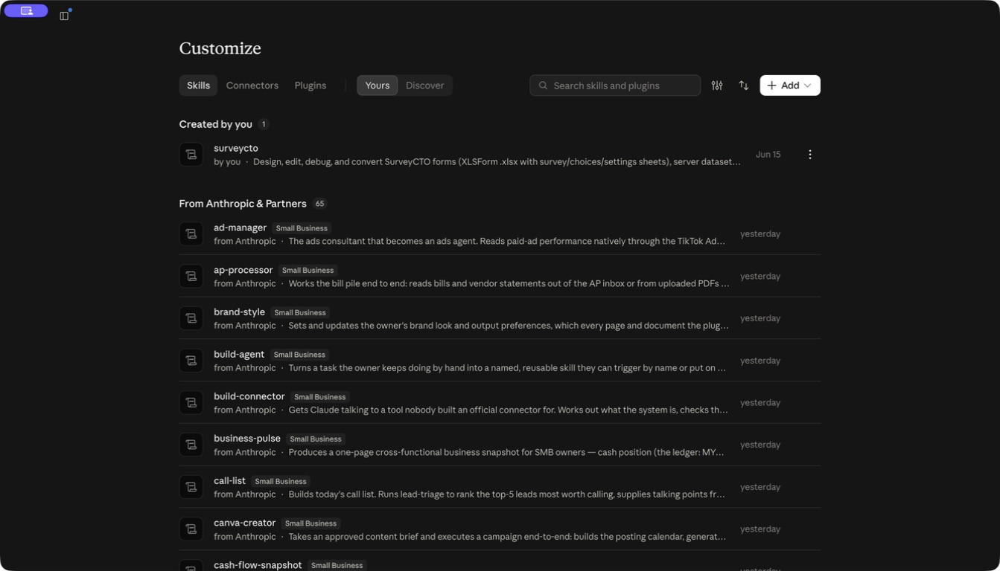
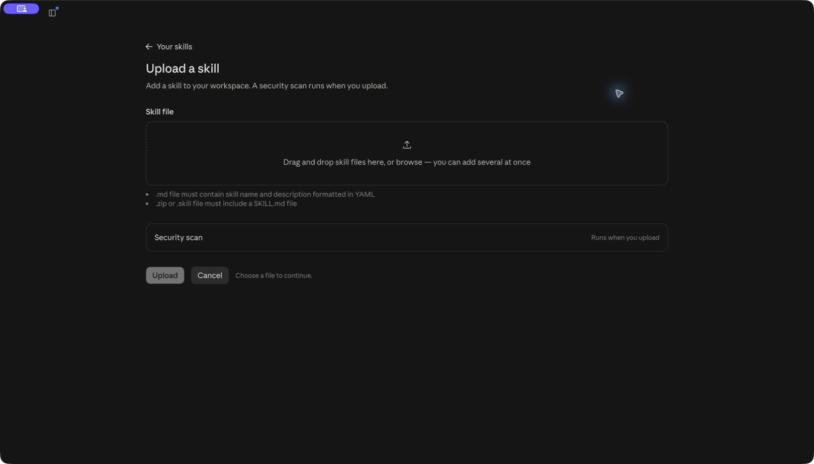
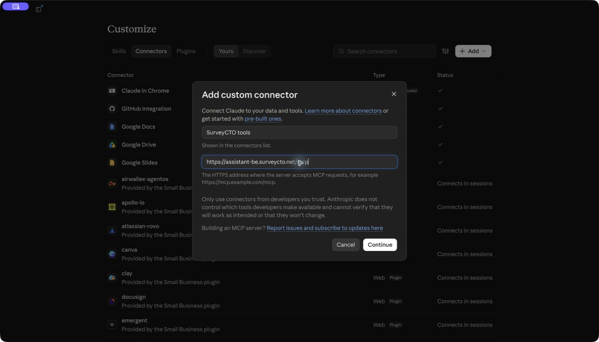
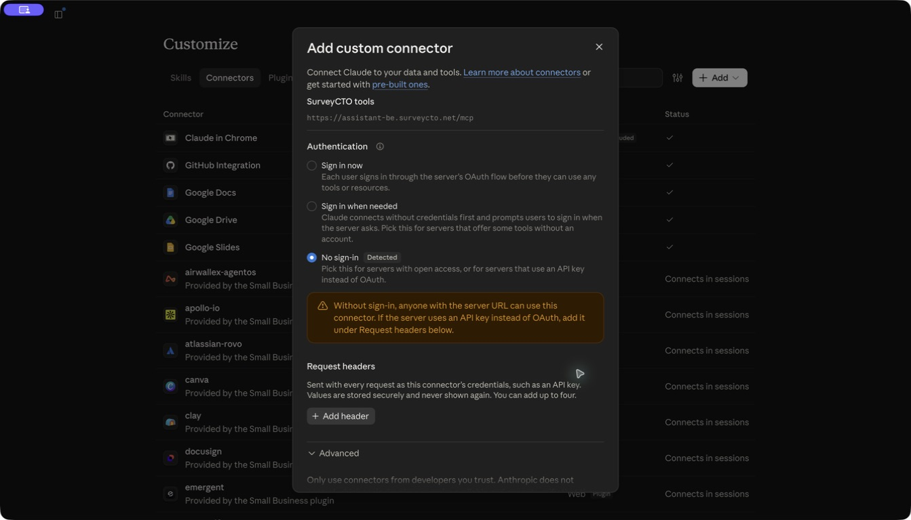
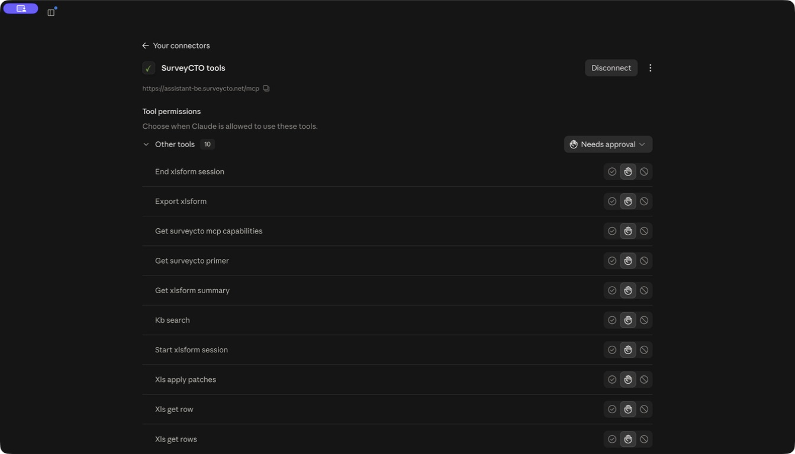
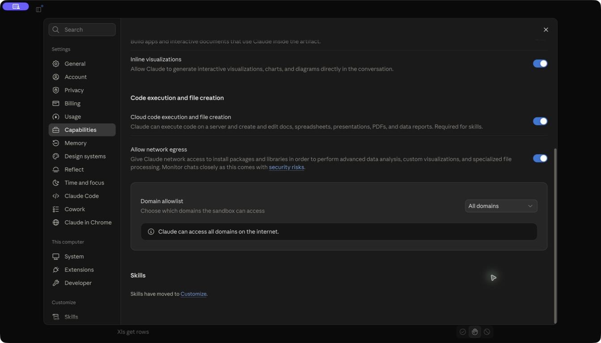

# Installing the SurveyCTO Agent Skill

This guide covers installing the skill, connecting the SurveyCTO MCP server, enabling the network access the MCP server requires, and troubleshooting common installation issues. For an overview of what the skill is and where to download it, see the project [README](https://github.com/surveycto/surveycto-agent-skill#readme).

This file ships inside `surveycto-skill.zip` so the agent can reference it mid-session when coaching a user through installation or network-egress problems.

## Components

For the best experience, install both:

1. **The skill itself** (`surveycto-skill.zip`) — teaches the agent SurveyCTO domain expertise.
2. **The SurveyCTO MCP server** at `https://assistant-be.surveycto.net/mcp` — provides purpose-built XLSForm tools and live knowledge-base search.

The skill works on its own, but without the MCP server (or without working network access to it) the agent cannot reliably edit XLSForm files. See [Why the MCP server matters](#why-the-mcp-server-matters) below.


## Claude (formerly Cowork)

[Anthropic has brought Cowork into Claude](https://claude.com/blog/cowork-is-now-claude), so you can use the skill in a normal Claude conversation without selecting a separate Cowork tab. The steps and screenshots below show the integrated interface in October 2026. Availability and labels can vary by account and rollout; update the desktop app if your interface differs. You need access to skills, custom connectors, and code execution; organization settings may restrict these features.

### Install the skill

1. Download [surveycto-skill.zip](https://github.com/surveycto/surveycto-agent-skill/releases/latest/download/surveycto-skill.zip).
2. Open **Customize** in Claude's sidebar, then select **Skills**. You may also find **Skills** at the **Settings** menu if you use the search bar.
3. Click **Add → Upload skill**.
  
4. Drop the zip into the upload area, or click to browse for it. Review the skill preview, then click **Upload** to start the security scan. Wait for it to finish and follow any scan prompts.
  
5. Confirm **surveycto** appears under **Yours** and is enabled. If Claude asks you to enable code execution, use **Settings → Capabilities → Cloud code execution and file creation**.

Some versions put **Upload a skill** inside **Create skill** instead. See [Claude's skills guide](https://support.claude.com/en/articles/12512180-use-skills-in-claude) for account-specific requirements.

### Connect the SurveyCTO tools

1. Under **Customize → Connectors**, click **Add → Add custom connector**. If your menu instead shows **Custom**, select **Web** for a remote MCP server.
2. Enter **SurveyCTO tools** as the name and `https://assistant-be.surveycto.net/mcp` as the **MCP server URL**, then click **Continue**.
  
3. Leave authentication set to **No sign-in** and click **Add** at the bottom of the dialog (scroll down if needed). This public server does not require a SurveyCTO username, password, API key, or custom request headers.
  
4. On the **SurveyCTO tools** page, click **Connect** if shown. Once connected, choose its **Tool permissions**. **Always allow** approves this connector's tool calls automatically. Choose **Needs approval** if you prefer to approve calls, or **Custom** to set permissions per tool. Other kinds of actions may still require approval.
  

For more about these options, see [Claude's connectors guide](https://support.claude.com/en/articles/11176164-use-connectors-to-extend-claude-s-capabilities).


### Network egress (Claude)

Connecting the MCP server and allowing file transfers are separate steps. Claude's code-execution environment needs outbound HTTPS to `assistant-be.surveycto.net` to upload and download XLSForm files, even when the connector's other tools already work.

1. Open **Settings → Capabilities**.
2. Confirm **Cloud code execution and file creation** is on (required for skills).
3. Turn on **Allow network egress**.
4. Under **Domain allowlist**, keep **Package managers only**, enter `*.surveycto.net` under **Additional allowed domains**, and click **Add**. Confirm the domain appears in the list. If **All domains** is already selected, SurveyCTO is covered.
  
5. Start a new chat and check the setup below. If these settings are managed by your organization, ask your administrator to enable the required access.

### Check the setup

In a new Claude conversation, open **+ → Connectors** (or type `/` to open the menu) and ensure **SurveyCTO tools** is enabled for that conversation. Then ask:

> Using the SurveyCTO skill, report the skill version and call get_surveycto_mcp_capabilities. Upload the bundled XLSForm template into a temporary MCP session, export the unchanged workbook, and download it to a new local file using the returned download URL. Confirm both transfers succeeded, then end the temporary session.

Confirm the skill loaded and both file transfers succeeded. A successful capabilities call alone does not verify file-transfer access. You can then attach your form and ask Claude to work on it.

## OpenAI Codex

### Install the skill

Extract the downloaded zip into the user skills directory. On macOS or Linux, run these commands from the directory containing `surveycto-skill.zip`:

```bash
mkdir -p ~/.agents/skills/surveycto
unzip surveycto-skill.zip -d ~/.agents/skills/surveycto
```

The result must include `~/.agents/skills/surveycto/SKILL.md`, without an extra nested folder. On Windows, extract into `.agents/skills/surveycto` under your user home directory.

Codex discovers skills in `~/.agents/skills`. The desktop app also has a **Skills** view; the CLI and IDE extension let you list skills with `/skills` and invoke one with `$surveycto`. If the new skill does not appear, restart the app or session. See [OpenAI's skills guide](https://developers.openai.com/codex/skills/) for the interface available in your client.

### Connect the SurveyCTO tools

In the desktop app:

1. Open **Settings → MCP servers → Add server**.
2. Use `surveycto` as the name, select **Streamable HTTP**, and enter `https://assistant-be.surveycto.net/mcp` as the URL. Leave authentication and custom headers unset.
3. Save the server and restart the app when prompted. Confirm the server is enabled.

Alternatively, configure it with the Codex CLI:

```bash
codex mcp add surveycto --url https://assistant-be.surveycto.net/mcp
```

OpenAI's [MCP setup guide](https://developers.openai.com/codex/mcp/) covers the desktop app, CLI, and IDE extension. Current OpenAI documentation may refer to the desktop client as the ChatGPT desktop app.

### Permissions and network access

Approval prompts depend on your client and policy. Approve SurveyCTO tool calls as needed. Codex can also restrict network access for commands such as `curl`: an enabled MCP server does not automatically authorize XLSForm uploads and downloads from the command sandbox. If a transfer is blocked, approve the requested network access to `assistant-be.surveycto.net` or ask your administrator to allow it under your organization's policy. See [OpenAI's approvals and security guide](https://learn.chatgpt.com/docs/agent-approvals-security).

Use the prompt in [Check the setup](#check-the-setup) in a new Codex session before working on a form; the Claude connector-menu step does not apply to Codex.

## Other Agent Skills-compatible hosts

This skill follows the [Agent Skills](https://agentskills.io) open standard. For other hosts (Claude Code, Cursor, VS Code Copilot, Gemini CLI, Roo Code, etc.), consult the host's documentation for skills and MCP servers. In general:

- **Skill**: extract `surveycto-skill.zip` into the host's skills directory (often `~/.<host>/skills/surveycto` or similar).
- **MCP server**: register `https://assistant-be.surveycto.net/mcp` (Streamable HTTP, no auth). For stdio-only clients, wrap with `mcp-remote`:
  ```json
  {
    "surveycto": {
      "command": "npx",
      "args": ["-y", "mcp-remote", "https://assistant-be.surveycto.net/mcp"]
    }
  }
  ```
- **Network access**: if your host sandboxes skill execution, ensure outbound HTTPS to `*.surveycto.net` (or at minimum `assistant-be.surveycto.net`) is allowed. Hosts that run skills directly on your machine typically just prompt for permission on the first `curl` and need no separate egress configuration.

## Why the MCP server matters

The SurveyCTO MCP server provides session-based XLSForm tools with SurveyCTO-aware parsing, atomic patches, formula recalculation on export, and formatting preservation. Without it — or with it installed but blocked by egress — the agent falls back to generic spreadsheet tooling (commonly Python's `openpyxl`), which in practice round-trips the SurveyCTO XLSForm template poorly: conditional formatting, formula recalculation state, the help worksheets, named styles, and row coloring are frequently lost or corrupted. Users end up fixing formatting by hand in Excel after every export.

Inline base64 transport (`xlsx_base64` on `start_xlsform_session`, `format="base64"` on `export_xlsform`) is also not a viable workaround: a real XLSForm encoded as base64 is too large to round-trip through agent tool-call parameters. The bundled 154 KB template alone becomes ~205 KB of base64 (~195K tokens), which exceeds typical agent read/parameter limits.

If you want a smooth experience, install the MCP server *and* unblock egress before you start working.

## Troubleshooting

### "The agent uploaded fine the first time but now everything is failing"

Check the underlying error before retrying. Verify [network egress](#network-egress-claude) and, if you changed the settings during a Claude conversation, **start a new chat** and repeat the upload preflight.

### "Network egress is on and the domain is allowed, but uploads still fail"

- Double-check you started a new chat *after* enabling egress.
- Confirm the domain entry is `*.surveycto.net` (or `All domains`), not just `surveycto.com`.
- In a fresh chat, ask the agent to run the MCP preflight (start a session, upload the bundled template, end the session). The agent will surface the underlying error message.

### "The MCP tools aren't showing up at all"

- In Claude: confirm the connector appears under **Customize → Connectors**, is enabled in the conversation's **+ → Connectors** menu, and its tool permissions are not **Blocked**.
- In Codex or stdio clients: restart the host after adding the server.
- In any host: ask the agent to call `get_surveycto_mcp_capabilities` — if that fails, check the connector status, permissions, and reported error before troubleshooting file uploads.

### "The agent is editing XLSForms with `openpyxl` instead of MCP tools"

The agent only falls back to generic tooling when MCP isn't connected or upload/download is failing. Run the MCP preflight in a fresh chat to see which.